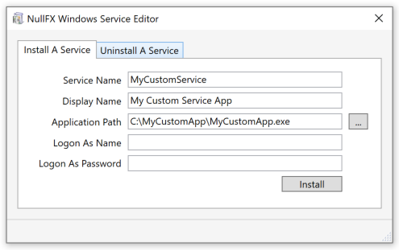
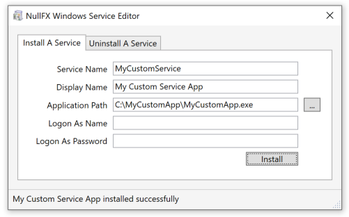
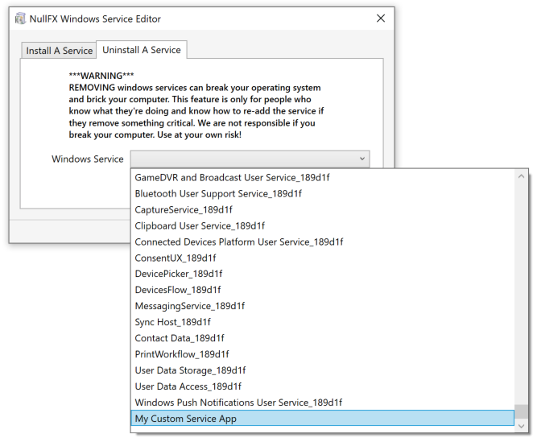
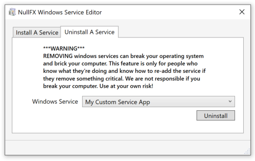
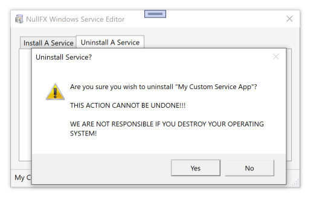
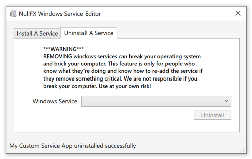

# NullFX Windows Service Editor

The NullFX Windows Service Editor is an app that facilitates the simple installation and removal of windows services.

The applications that this utility can register as a windows service need to either implement [standard Win32](https://docs.microsoft.com/en-us/windows/win32/api/winsvc/nc-winsvc-lpservice_main_functionw) windows service apis or the .net [ServiceBase](https://docs.microsoft.com/en-us/dotnet/api/system.serviceprocess.servicebase?view=dotnet-plat-ext-5.0) base class.  While this utility can technically register any executable as a windows service, that service will not be able to respond to the service `Start` and `Stop` commands unless these API's are implemented in the executable.  

Future releases will provide a Service Host (similar concept as `svchost.exe`) style application that can be configured to launch and terminate applications that do not implement the Win32 windows service API's or .net ServiceBase class allowing stand alone command line applications to run as services without any modifications. 

## Installing an application to run as a service

To install an application as a service:

1. Provide the applications Service name
2. Populate the applications Display name
3. Specify the file path to the executable
4. If the service requires a Log On as account, specify the credentials to the user who has been assigned to the Log On As service group
5. If the service requires a Log On as account, specify the credential password
6. Click Install

## Uninstalling a windows service

**\*\*\*DISCLAIMER\*\*\***: This application has the ability to uninstall **_any and all windows services_** including those required to make your operating system function properly.  Removal of some windows services can cause you to have to reinstall your operating system.  This application should not be installed or used by anyone on a computer system they do not wish to completely destroy and we do not accept responsibility for any loss incured by the use of this software what so ever.  It is possible, plausable, and highly likely that you WILL do **_irreparable_** and catastrophic damage to your operating system for which the user alone bears full responsiblility for. 

To uninstall a windows service:

1. Select the service you wish to uninstall
2. Click Uninstall
3. Confirm you wish to uninstall

# How the Application Works

The application works by using the Windows SDK and registering the applications by calling [CreateService](https://docs.microsoft.com/en-us/windows/win32/api/winsvc/nf-winsvc-createservicew) and [DeleteService](https://docs.microsoft.com/en-us/windows/win32/api/winsvc/nf-winsvc-deleteservice).  This simple utility doesn't register dependent services (which it could do in the future) or link existing services as dependencies to new services being registered (which it also could do).

This is just an application I wrote (in win32) ages ago and converted to wpf to put up on github in case anyone else found it useful.  I've mostly moved over completely to macOS but find this useful for times when I need to register services for work.  

**As it can seriously damage a system please use caution when using the uninstall feature.**
